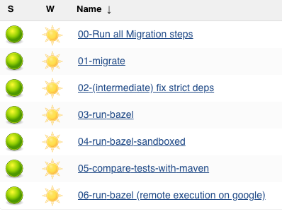

# Run Migration on Jenkins
When migrating using Exodus, it is a good idea to use a build server such as Jenkins. The migration is a computational intensive operation and offloading this work to a build server allows you to continue working in your local environment while the migration is running. Another advantage is that a build server can help alleviate the grunt work of dealing with an iterative process such as this migration.

## Prerequisites
You'll need the following before running a migration on Jenkins.

### Jenkins Server Setup
- Jenkins LTS
- Install the following plugins:
    - [Pipeline](https://wiki.jenkins.io/display/JENKINS/Pipeline+Plugin)
    - [Timestamper](https://wiki.jenkins.io/display/JENKINS/Timestamper)
    - [AnsiColor](https://wiki.jenkins.io/display/JENKINS/AnsiColor+Plugin)
    - [Custom tool plugin](https://wiki.jenkins.io/display/JENKINS/Custom+Tools+Plugin)
    - [Git plugin](https://wiki.jenkins.io/display/JENKINS/Git+Plugin)
    - (Optional) [Slack](https://wiki.jenkins.io/display/JENKINS/Slack+Plugin)

### Install Bazel:
1. Open **"Global Tool Configuration**
2. Expand "Custom Tools"
3. Click **"Add Custom tool"**
4. Enter the following:

    - Name: `bazel`
    - Exported Paths: `bin`
    - Install automatically: yes
    - Choose **"Run Shell Command"** and enter the following shell command. (This example is for Bazel 0.24.1, edit your code to match your Bazel version).

        ```bash
        # Fetch the Bazel installer
        pwd
        BAZEL_VERSION=0.24.1
        BASE=$(pwd)/${BAZEL_VERSION}
        BAZEL_INSTALLER=${BASE}/install.sh
        URL=https://github.com/bazelbuild/bazel/releases/download/${BAZEL_VERSION}/bazel-${BAZEL_VERSION}-installer-linux-x86_64.sh
        if [ ! -f ${BASE}/bin/bazel ]; then
            mkdir -p ${BASE}
            curl -L -o ${BAZEL_INSTALLER} ${URL}
            # Install bazel inside ${BASE}
            bash "${BAZEL_INSTALLER}" \
            --prefix="${BASE}"
        else
            echo "BAZEL ${BAZEL_VERSION} is already installed"
        fi
        ```
   - Tool home: `0.24.0`

### Install Buildozer
Follow the same steps as above, but with the tool home and name `buildozer` and the following shell command. (This example is for Buildozer v0.20.0, edit your code to match your Buildozer version).

```bash
# Fetch the Bazel installer
pwd
VERSION=0.20.0
BASE=$(pwd)/buildozer
URL=https://github.com/bazelbuild/buildtools/releases/download/${VERSION}/buildozer
if [ ! -f ${BASE}/bin/buildozer ]; then
    mkdir -p ${BASE}/bin
    curl -L -o ${BASE}/bin/buildozer $URL
    chmod +x ${BASE}/bin/buildozer
    echo "buildozer is installed on ${BASE}/bin/buildozer"
else
    echo "buildozer is already installed"
fi
```

### Install buildifier
Follow the same steps as above, but with the tool home and name `buildifier` and the following shell command: (This example is for buildifier 0.20.0, edit your code to match your buildifier version).

```bash
# Fetch the Bazel installer
pwd
VERSION=0.20.0
BASE=$(pwd)/buildifier
URL=https://github.com/bazelbuild/buildtools/releases/download/${VERSION}/buildifier
if [ ! -f ${BASE}/bin/buildifier ]; then
    mkdir -p ${BASE}/bin
    curl -L -o ${BASE}/bin/buildifier -L $URL
    chmod +x ${BASE}/bin/buildifier
    echo "buildifier is installed on ${BASE}/bin/buildifier"
else
    echo "buildifier is already installed"
fi
```

### Build Pipeline

In the build pipeline add the following environment:

```groovy
environment {
        BAZEL_HOME = tool name: 'bazel', type: 'com.cloudbees.jenkins.plugins.customtools.CustomTool' // needs https://wiki.jenkins.io/display/JENKINS/Custom+Tools+Plugin
        BUILDOZER_HOME = tool name: 'buildozer', type: 'com.cloudbees.jenkins.plugins.customtools.CustomTool'
        BUILDIFIER_HOME = tool name: 'buildifier', type: 'com.cloudbees.jenkins.plugins.customtools.CustomTool'
        PATH = "$BAZEL_HOME/bin:$BUILDOZER_HOME/bin:$BUILDIFIER_HOME/bin:$JAVA_HOME/bin:$PATH"
    }
```

## Configure Jenkins Jobs

Configure the following Jenkins Jobs:



- 00-Run all Migration steps
    - Script: migrator/scripts/e2e.groovy
- 01-migrate
    - Script: migrator/scripts/migrate.groovy
    - Parameters:
        - TRIGGER_BUILD - Default: true - Should it trigger run-bazel job on finish.
        - COMMIT_HASH - Default: master
    - Build Triggers:
        - Build after other projects are built > Projects to watch > `../Migrate-All` > Trigger only if build is stable. 
- 02-run-maven
    - Script: migrator/scripts/run-maven.groovy
    - Parameters: 
        - BRANCH_NAME - REQUIRED - The latest migrated branch or any other branch.
        - CLEAN - Default: false - Clean Bazel before running, allowing for re-evaluation of warnings, but slowing down build time.
        - COMMIT_HASH - Default: master
- 02-(intermediate) fix strict deps
    - Script: migrator/scripts/fix-strict-deps.groovy
    - Parameters:
        - BRANCH_NAME - Default: master
        - CLEAN - Default: false - Clean Bazel before running, allowing for re-evaluation of warnings, but slowing down build time.
       - TRIGGER_BUILD - Default: true - Should it trigger run-bazel job on finish.
- 03-run-bazel
    - Script: migrator/scripts/run-bazel.groovy
    - Parameters:
        - BRANCH_NAME - REQUIRED - The latest migrated branch or any other branch.
        - CLEAN - Default: false - Clean Bazel before running, allowing for re-evaluation of warnings, but slowing down build time.   
- 04-run-bazel-sandboxed
    - Script: migrator/scripts/run-bazel-sandboxed.groovy
    - Parameters:
        - BRANCH_NAME - REQUIRED - The latest migrated branch or any other branch.
        - CLEAN - Default: false - Clean Bazel before running, allowing for re-evaluation of warnings, but slowing down build time.
- 05-compare-tests-with-maven
    - Script: migrator/scripts/compare.groovy
    - Parameters:
        - BAZEL_COMPARE_JOB - Default: 02-run-bazel - The number of bazel-run-* job (local, RBE, etc) to take results from.
        - BAZEL_RUN_NUMBER - Default: change-me - The number of bazel-run-* to take results from.
        - MAVEN_RUN_NUMBER - Default: change-me - The number of run-maven to take results from.
        - BRANCH_NAME - Default: master - The name of the migration branch.
        - ALLOW_MERGE - Default: false - Whether to allow auto-merge to master.
        - MAVEN_SUCCESS - Default: false - Whether or not the maven run was successful.
- 06-run-bazel (remote execution of google)
    - Optional
    - Script: migrator/scripts/run-bazel-rbe.groovy
    - Parameters:
        - BRANCH_NAME - REQUIRED - The latest migrated branch or any other branch.
        - CLEAN - Default: false - Clean Bazel before running, allowing for re-evaluation of warnings, but slowing down build time.


